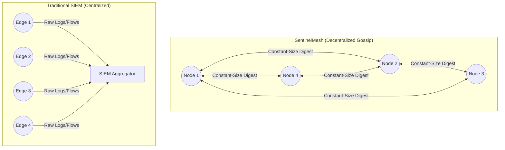
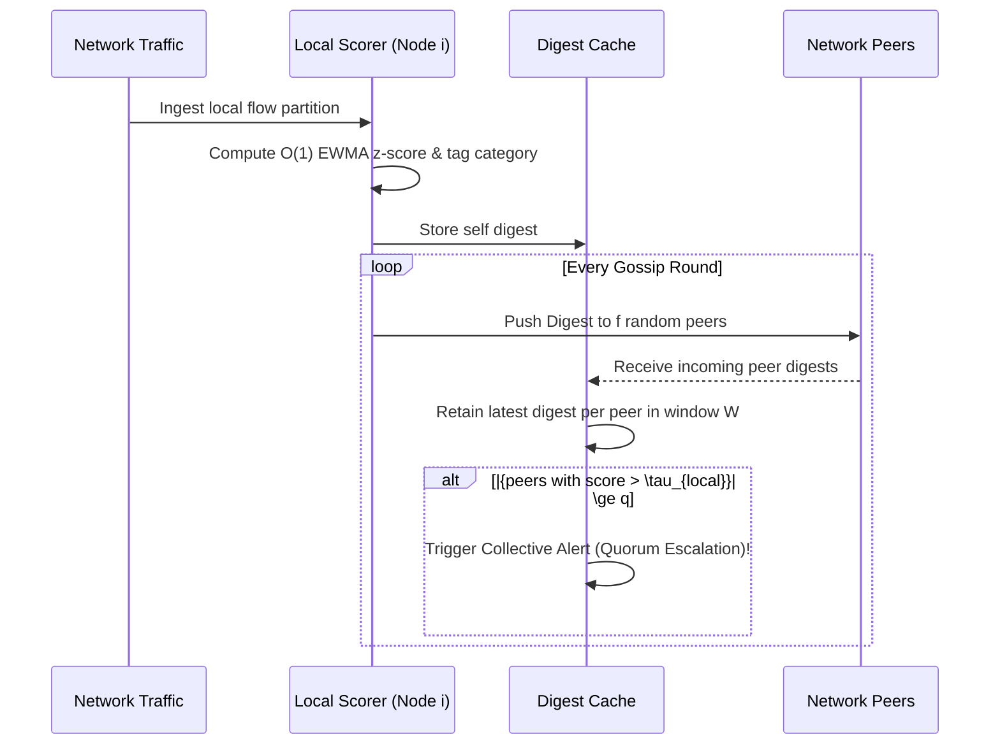

# SentinelMesh: Gossip-Propagated Collective Anomaly Detection

**SentinelMesh** is a decentralized anomaly correlation framework designed for distributed network intrusion sensing. Modern network defense typically relies on centralized Security Information and Event Management (SIEM) pipelines, which create latency bottlenecks, incur massive bandwidth costs, and introduce a single point of failure.

SentinelMesh replaces the centralized aggregator with a lightweight, decentralized **gossip-based correlation** mechanism. Independent IDS nodes exchange compact anomaly summaries via an epidemic protocol, utilizing a quorum consensus rule to collectively escalate "low-and-slow" attacks (e.g., distributed port scans, credential stuffing) that appear statistically normal to any single node.

---

## 🏛 Architecture

### System Topology


### Node Workflow


---

## 📂 Project Structure (Multi-Track Monorepo)

This repository is organized into three parallel tracks to support simulation, machine-learning validation, and data visualization.

- **`simulator/` (Track 1 - Go)**: The core discrete-event simulation engine. Handles the parsing of the UNSW-NB15 dataset, pseudo-random node partitioning, $O(1)$ EWMA scoring, epidemic push-gossip exchange, and the quorum escalation rule.
- **`ml-crosscheck/` (Track 2 - Python)**: Independent scorer validation. Uses models like Isolation Forests and Autoencoders to cross-check the Go scorer's escalations and generate validation summaries.
- **`dashboard/` (Track 3 - Next.js)**: A frontend web application for interactive sweep result exploration. Visualizes metrics such as recall, bandwidth overhead, and convergence latency across variables like mesh size ($N$) and fanout ($f$).

*Supporting directories include `data/` (datasets and fetch scripts), `docs/` (architecture & progress tracking), `results/` (shared output contract), and `paper/` (LaTeX sources).*

---

## 🚀 Quickstart

### 1. Fetch the Dataset
The simulation utilizes the standard UNSW-NB15 dataset. Download it using the provided script:
```bash
./data/scripts/fetch_dataset.sh
```

### 2. Run the Simulator
Navigate to the simulator track and run a parameter sweep using the default configuration values. *(Execution CLI is under active development)*:
```bash
cd simulator
go run cmd/simulate/main.go --config configs/sweep_default.yaml
```

### 3. View Results
Results are written as CSV output to the `results/sweep/` directory. You can start the Next.js dashboard to interactively visualize the evaluation metrics:
```bash
cd dashboard
npm install
npm run dev
```

---

## 🧪 Testing

### Test Stats (all passing)

| Track | Language | Tests | Packages/Files |
|---|---|---|---|
| Core Simulator | Go | **41** | 10 packages |
| ML Crosscheck | Python | **49** | 3 test files |
| Dashboard | TypeScript | — | Not yet implemented |
| **Total** | | **90** | |

### Track 1 — Simulator (Go)

**41 tests** across the following packages:

| Package | Tests | Focus |
|---|---|---|
| `dataset` | 3 | CSV parsing, flow extraction, error handling |
| `fragment` | 3 | Node partitioning, fragmentation, count preservation |
| `scorer` | 5 | EWMA z-score, bounds, repeatability |
| `node` | 4 | Node logic, digest cache, flow ingestion |
| `gossip` | 4 | Epidemic push, peer selection, stale eviction |
| `quorum` | 5 | Escalation rule, thresholds, multi-category, window |
| `baseline` | 3 | Independent/centralized runs, no-alert cases |
| `metrics` | 5 | Recall, bandwidth, latency, edge cases |
| `sweep` | 3 | Config loading, sweep execution |
| `tests` (integration) | 3 | Full pipeline, sweep E2E, baseline comparison |

```bash
cd simulator && go test ./... -count=1
```

### Track 2 — ML Crosscheck (Python)

**49 tests** across 3 files:

| File | Tests | Focus |
|---|---|---|
| `test_dataset.py` | 23 | Data loading, labeling, features, split, normalize, partition |
| `test_models.py` | 15 | Isolation Forest, Autoencoder, Go EWMA replica, score bounds |
| `test_integration.py` | 11 | Full pipeline, per-category metrics, CSV/JSON report output |

```bash
cd ml-crosscheck && pytest tests/ -v
# or from project root:
python -m pytest tests/ml-crosscheck/ -v
```

### Test Data
A small synthetic CSV dataset at `simulator/testdata/testdata.csv` with 15 flows across 7 attack categories (analysis, backdoor, dos, exploits, fuzzers, generic, reconnaissance) plus normal traffic. Used by both Go and Python test suites.

---

## 📊 Evaluation Goals

Based on discrete-event simulation using partitioned UNSW-NB15 traffic, this framework aims to measure:
- **Detection Recall**: The system's ability to recover detection capability for fragmented reconnaissance against baseline isolated edge nodes.
- **Bandwidth Overhead**: The reduction in peak single-point load compared to a centralized SIEM, tracking per-node payload costs.
- **Convergence Latency**: The scaling behavior of gossip propagation across varying mesh sizes, measured in discrete gossip rounds.