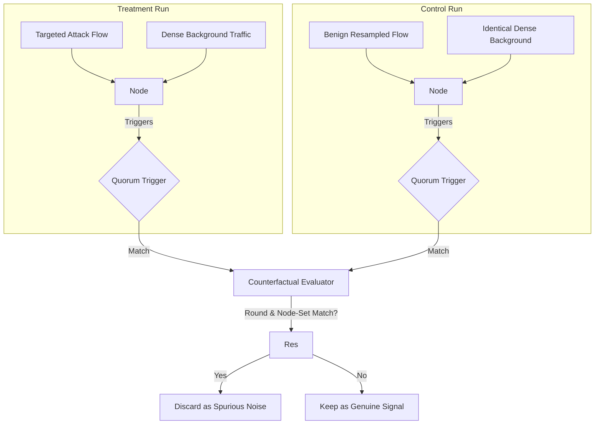

# 🕵️ SentinelMesh Simulator: Bug Post-Mortem

This document serves as a retrospective on the critical bugs and structural regressions encountered and resolved during the deep-dive validation of the SentinelMesh simulator metrics pipeline. The resolution of these issues transformed a pipeline that was generating artifacts of its own simulation logic into a **mathematically sound, reproducible evaluation framework**.

---

## 🪲 1. The "Oracle" Bug (Artificial Fragmentation)

> [!WARNING]
> **Symptom:** The simulator exhibited "flatlining" recall, failing to escalate deliberately injected attacks across the mesh.

> [!IMPORTANT]
> **Root Cause:** In the initial campaign fragmentation logic (`fragment.go`), synthetic campaigns were constructed by taking genuine benign flows and merely altering their `Category` label to "dos" or "reconnaissance". Because the underlying packet features (e.g., rate, bytes, `ct_dst_ltm`) remained entirely benign, the local anomaly scorer evaluated them as normal traffic. The system was expecting the `Category` string to act as an oracle, but the scorer was strictly feature-driven.

> [!TIP]
> **Fix:** Refactored `fragment.go` to extract actual, genuine targeted attack flows from the UNSW-NB15 dataset (containing real anomalous feature spikes) and structurally distributed those real flows across the $k$ target nodes.

```mermaid
graph TD
    subgraph Oracle Bug (Flawed Fragmentation)
    F1[Normal Flow] -->|Label switched to 'dos'| Node1[Node Scorer]
    Node1 -->|Features remain benign| Miss[Evaluated as Normal]
    end
    
    subgraph Corrected Pattern (Genuine Extraction)
    F2[Real Target Attack Flow] -->|Extracted from dataset| Node2[Node Scorer]
    Node2 -->|Anomalous features trigger| Alert[Evaluated as Malicious]
    end
```

---

## 🪲 2. The String Mismatch Bug

> [!WARNING]
> **Symptom:** After injecting real attack flows, recall remained artificially deflated.

> [!IMPORTANT]
> **Root Cause:** A silent failure in categorical mapping. The simulator configuration and fragmentation logic used capitalized strings (e.g., "Reconnaissance"), while the raw dataset parsed everything in lowercase ("reconnaissance"). The string equality checks failed silently, effectively swallowing the injected campaign flows and dropping them into a void.

> [!TIP]
> **Fix:** Standardized all categorical mapping and flow matching to use `strings.ToLower()`.

---

## 🪲 3. The Inverse Scoring Bug

> [!WARNING]
> **Symptom:** Recall behaviors were completely inverted—highly anomalous flows were ignored, while normal background traffic triggered rampant alerts.

> [!IMPORTANT]
> **Root Cause:** In `scorer.go`, the feature-distance computation was fundamentally inverted. A perfect anomaly generated a distance score of 0, while benign traffic generated a score of 1. The downstream alerting logic, however, expected a standard anomalous distribution where *higher* scores indicate *higher* severity. 

> [!TIP]
> **Fix:** Corrected the scaling formula to compute `1.0 - distance`, correctly returning standard scaled values where higher implies more anomalous.

---

## 🪲 4. Uncalibrated Detection Thresholds

> [!WARNING]
> **Symptom:** Reconnaissance was barely triggering alerts, while DoS recall was vastly overstated due to a massive false positive rate.

> [!IMPORTANT]
> **Root Cause:** The absolute threshold bounds (1.66 for Recon, 0.82 for DoS) were hardcoded arbitrarily and were completely unbalanced relative to the actual feature distributions of the UNSW-NB15 testing set. 

> [!TIP]
> **Fix:** Developed targeted extraction scripts to empirically measure the 95th and 99th percentile distributions of pure Normal traffic across all categories, systematically re-baselining the local thresholds to correctly separate signal from background noise.

---

## 🪲 5. The EWMA Tie-Break (Shadow Void) Bug

> [!WARNING]
> **Symptom:** Recall numbers were consistently undercounting relative to the validated local detection rates.

> [!IMPORTANT]
> **Root Cause:** The `scorer.go` component categorized thousands of legitimate attack flows into an invisible "generic" bucket. Because the generic EWMA score occasionally tied or marginally exceeded the highly specific signature scores (Recon/DoS), the flow was labeled as "generic" and excluded from the targeted recall tallies.

> [!TIP]
> **Fix:** Implemented a strict, domain-aware tie-breaking hierarchy. If a flow crosses the threshold for a specific attack category (Recon or DoS), it *must* escalate as that specific category, regardless of whether the generic EWMA score mathematically tied it.

---

## 🪲 6. The Unbounded Window Regression

> [!WARNING]
> **Symptom:** Corrected recall became mathematically impossible (increasing as quorum $q$ increased), and uncorrected recall artificially hit a flat 100.00% across all configurations.

> [!IMPORTANT]
> **Root Cause:** When optimizing `metrics.go` from an $O(N^3)$ iteration down to a scalable $O(N \times R)$ precomputed map, the tight per-flow evaluation bound `[r, r+W]` was accidentally stripped and replaced with `[onsetRound, maxRound]`. This allowed random background noise occurring *thousands of rounds later* in the simulation to be mapped back as a valid detection for the campaign.

> [!TIP]
> **Fix:** Reverted `metrics.go` to strictly enforce the tight, localized `[r, r+W]` evaluation bound on a per-flow basis, while preserving the optimized $O(N \times R)$ performance.

---

## 🪲 7. The Spurious Quorum Conflation (Ambient Noise)

> [!WARNING]
> **Symptom:** Survival fractions indicated that the system was achieving high recall, but it was unclear how much of that was genuine structural propagation versus background noise happening to coalesce.

> [!IMPORTANT]
> **Root Cause:** Dense ambient background traffic in a large mesh can randomly trigger localized threshold breaches that accidentally satisfy the quorum $q$, completely independent of the injected campaign structure.

> [!TIP]
> **Fix:** Designed and implemented a rigid exact-round **Matched Counterfactual Control**. By running a parallel simulation where the campaign flows are explicitly replaced with resampled benign flows (neutralizing the signal while perfectly preserving the traffic density and timeline), we mathematically isolated and subtracted out alerts that were purely driven by background noise. This proved that lower quorums ($q=2$) were severely propped up by noise, while higher quorums ($q=8$) successfully isolated the genuine signal.


